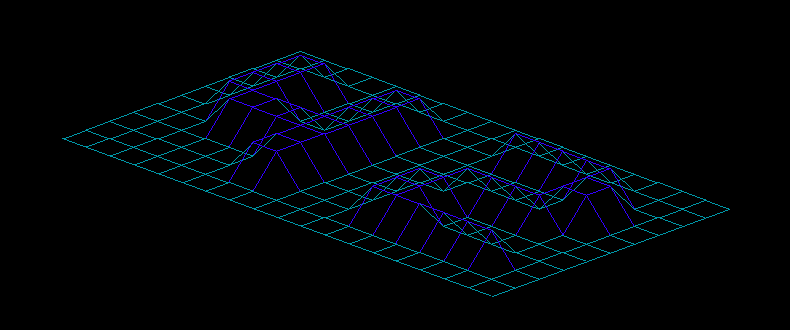

Above my code output.
This is one of our projet in my school. A text file (map) is given with (z cordinate)  we must read it and extract all x, y, z coordinate.I use a simplelinked list to store them. After that we must draw this map as a wireframe.
have a look to our own library function (if needed).
thanks
