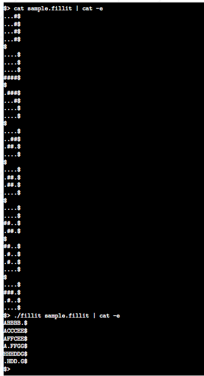

Basic tetris implementation called "fiilit" implented in c-language.
I use struct array to store pieces of tetriminos
As parameter we have a tetrimino's piece file which must be parsed.We must have this kind output(see below).

