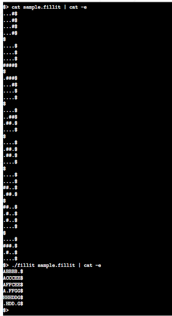

Basic tetris implementation called "fiilit" implented in c-language.
I use simple linked list  to store pieces of tetriminos.THIS is the second version. A tetrimino's pice file is given , we must parse it and join them optimally so that we get this kind of output(see below).

