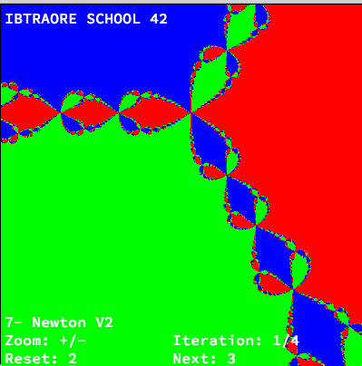

above one of my code output. i did many fractal in total. Fractal is an other projet. it is base on complex suit Z(n+1) = F (Zn). we must transform the formula (fractal formula) to extract the Real part (R(z)) from the imaginary part (Im(Z)) and deal with ietration.We can use the number of iteration to deal with color.
thanks
