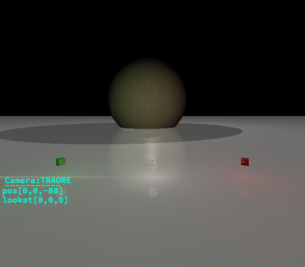
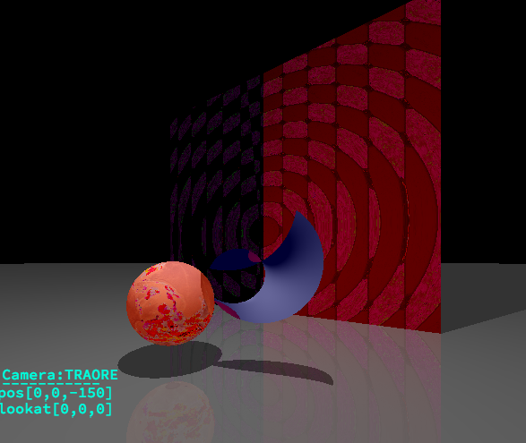
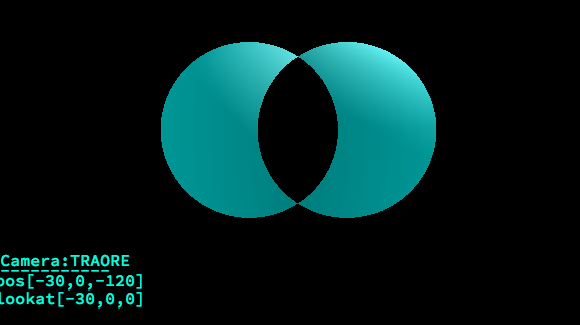
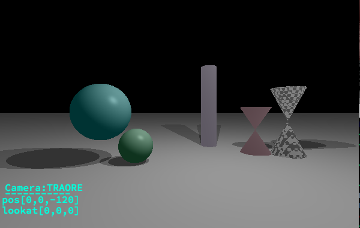
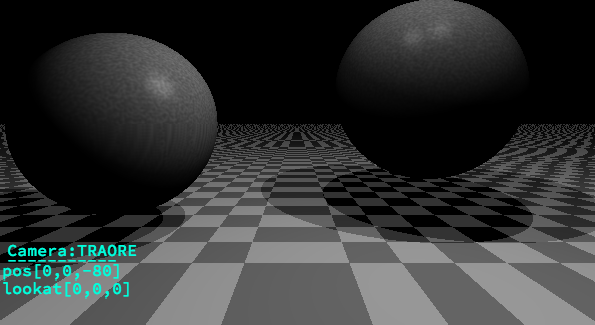
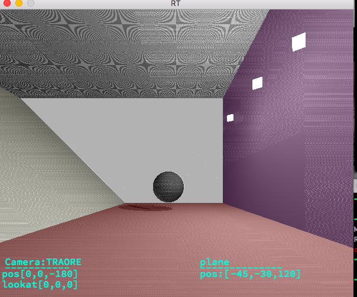
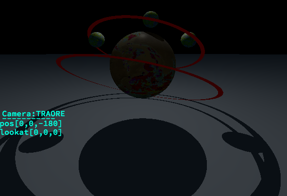
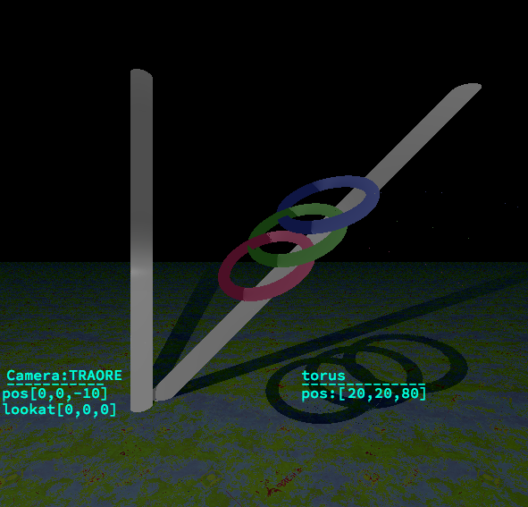

--------REFLECTION / REFRACTION ------

--------THE RED AND THE GREEN------

--------BLACK OR WHITE TABLE ------

-------- CYLINDRE DECOUPABLE (EN AXES X, Y, OU Z) ------

-----------------SEE MORE AND MORE----------------------

--------------------------------------------------------

---------------------------------------------------------

---------------------------------------------------------

--------------------------------------------------------

--------------------------------------------------------

--------------------------------------------------------

--------------------------------------------------------

--------------------------------------------------------

Raytracing Image.The last graphical project before going on training.this is done using multithread to deal with speed
