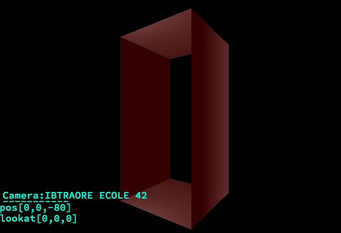
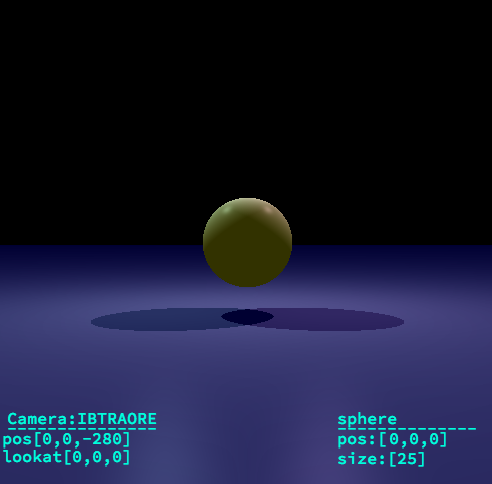
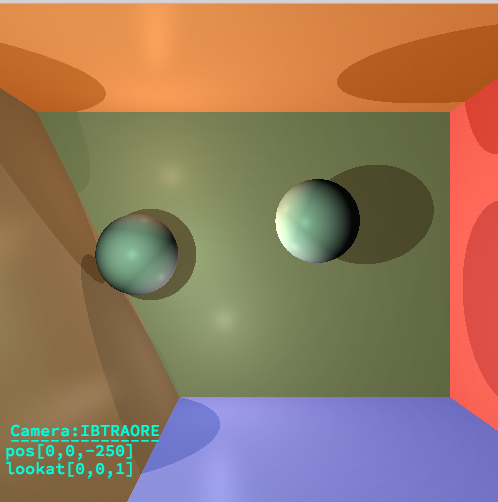
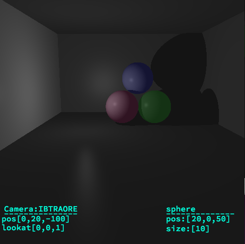
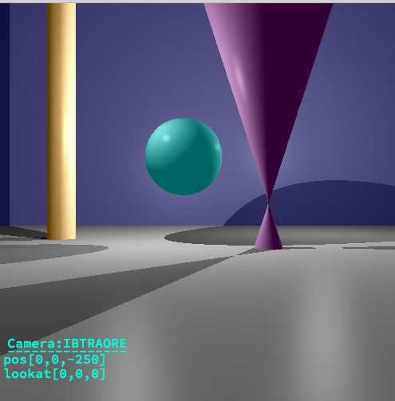

-------------------------------------------------------------
"DANS TOUT CE QUI SUIT :"
"ON PEUT SELECTIONNER UN OBJET DE LA SCENE"
"ET LE FAIRE TOURNER OU GLISSER LUI SEUL"
"SANS QUE LES AUTRES BOUGENT"
-------------------------------------------------------------

-------------------------------------------------------------

-------------------------------------------------------------

Basic raytracing Image. this is called rtv1 project.Amasing.We must throw camera ray and check for intersection with primitives.If intersection are found collect this primitive information(materials).Maths kwnoledges are needed.
