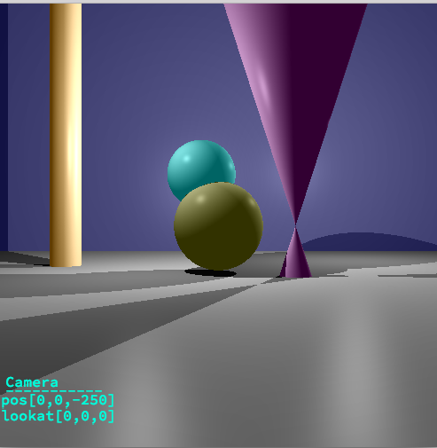
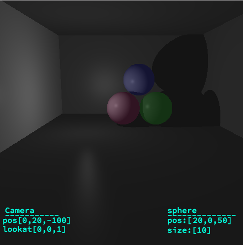

Basic raytracing Image. this is called rtv1 project.Amasing.We must throw camera ray and check for intersection with primitives.If intersection are found collect this primitive information(materials).Maths are needed.
