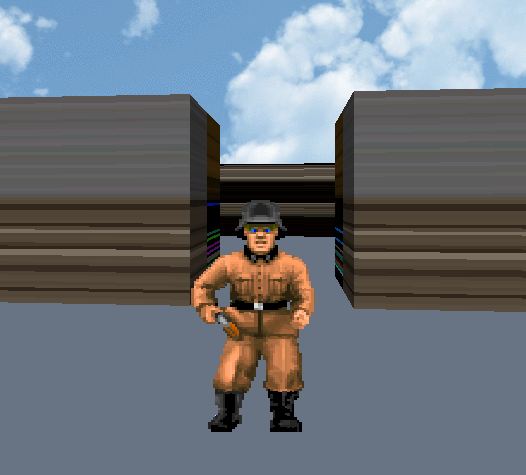

MY FIRST GAME 
Above my wolfeintein code output. this is one of our school project).
we were not oblige to deal with texture and object inside map but i try dio do it as a  bonus.
it is only basic.
if hit varible > 0, we hit something (depend of what number is inside map, each object has its number), we calculate the distance frm camera and we draw hit.
thanks
